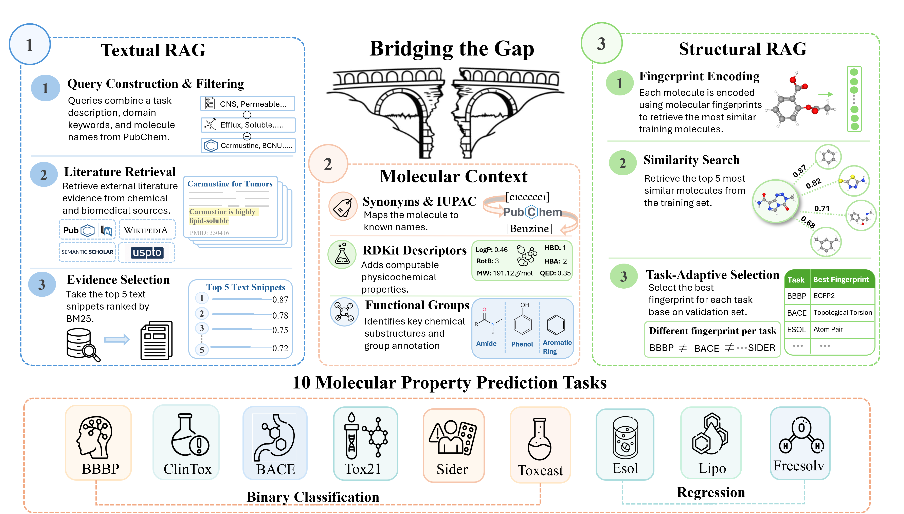

<div align="center">

# MolE-RAG: Molecular Structure-Enhanced Retrieval-Augmented Generation for Chemistry

<p align="center">
  <a href="https://arxiv.org/abs/2606.05693">
    
  </a>
</p>

</div>

## What is MolE-RAG?

MolE-RAG is a training-free framework for LLM-based molecular property prediction. Large language models struggle to reason over molecular structures because SMILES strings differ fundamentally from natural language. MolE-RAG bridges this gap by augmenting each prediction with three complementary sources of inference-time context — no fine-tuning required.



## Key Features

- **No training required**: Inference-time augmentation only — works with any LLM out of the box
- **Three context sources**: Text retrieval from chemistry literature, molecule-specific context (synonyms, functional groups, RDKit descriptors), and structural retrieval via task-adaptive fingerprints
- **Strong performance**: Improves ROC-AUC by up to 28 points on classification tasks and reduces regression RMSE by up to 67% over SMILES-only baselines across general-purpose LLMs
- **Broad model coverage**: Evaluated on Llama, Mistral, Qwen3, ChemDFM, GPT-4o-mini, and GPT-5.4-nano across 9 MoleculeNet benchmarks

## Repository Structure

```
MolE-RAG/
├── src/                          # Core framework code
│   ├── molerag.py                # Full MolE-RAG pipeline entry point (text + structure + context)
│   ├── mol_context_only.py       # Molecular context injection without retrieval
│   ├── retrieval/                # Text and structural retrieval
│   │   ├── chemrag_retrieval.py  # BM25 text retrieval over the ChemRAG corpus
│   │   └── fingerprint_sweep.py  # Fingerprint sweep for task-adaptive selection
│   ├── context/                  # Molecular context injection
│   │   ├── prompt_blocks.py      # Context injection building blocks (synonyms, FGs, descriptors)
│   │   ├── compute_rdkit.py      # RDKit descriptor computation
│   │   └── compute_feature_correlation.py  # Task-adaptive descriptor selection
│   └── evaluation/               # Evaluation scripts
│       ├── evaluate.py           # Multi-configuration evaluation (ROC-AUC, RMSE)
│       └── chemrag_evaluate.py   # Single-run evaluation for chemrag_retrieval outputs
├── scripts/
│   ├── baseline/                 # SMILES-only baseline scripts (per task)
│   └── data_preparation/         # Data split and fewshot pool generation
│       ├── make_scaffold_splits.py
│       ├── rebuild_fewshot_pools.py
│       ├── select_best_fingerprint.py
│       ├── fetch_missing_synonyms.py
│       └── build_syn_cache.py
├── data/                         # MoleculeNet scaffold splits (3 seeds)
│   └── moleculenet_property_scaffold/
│       ├── seed_0/
│       ├── seed_1/
│       └── seed_2/
├── results/                      # Experiment results (per task, per seed)
│   ├── bbbp/
│   ├── bace/
│   ├── clintox/
│   ├── hiv/
│   ├── tox21/
│   ├── sider/
│   ├── esol/
│   ├── freesolv/
│   └── lipo/
├── caches/                       # Pre-computed caches
│   ├── llm_filtered_synonyms.json    # LLM-filtered PubChem synonyms
│   ├── synonyms_cache.json           # Raw PubChem synonym cache
│   ├── task_keywords_llm.json        # LLM-generated task keywords
│   └── task_rdkit_features.json      # Task-relevant RDKit descriptors
├── requirements.txt
└── README.md
```

## Quick Start

Reproduce the full MolE-RAG results (no corpus setup needed — BM25 retrieval is pre-cached):

```bash
# 1. Clone and install
git lfs install
git clone https://github.com/jchan58/MolE-RAG.git
cd MolE-RAG
pip install -r requirements.txt

# 2. Add your API key
echo "OPENAI_API_KEY=sk-..." > .env

# 3. Run MolE-RAG on BBBP with GPT-4o-mini (all 3 seeds)
python src/molerag.py --dataset bbbp --models gpt-4o-mini --seed 0
python src/molerag.py --dataset bbbp --models gpt-4o-mini --seed 1
python src/molerag.py --dataset bbbp --models gpt-4o-mini --seed 2

# 4. Evaluate
python src/evaluation/evaluate.py --tasks bbbp --seeds 0 1 2
```

For open-source models (no API key needed, requires GPU):
```bash
python src/molerag.py --dataset bbbp --seed 0 --models Qwen/Qwen3-4B-Instruct-2507
```

## Setup

### Cloning

This repository uses [Git LFS](https://git-lfs.com) to store large files (result JSONL files, data CSVs, and caches). Make sure Git LFS is installed before cloning:

```bash
git lfs install
git clone https://github.com/jchan58/MolE-RAG.git
```

If you cloned without LFS, run `git lfs pull` to download the large files.

### Requirements

```bash
pip install -r requirements.txt
```

### External Dependencies

1. **Environment Variables**: Create a `.env` file in the repo root:
   ```
   OPENAI_API_KEY=your-key-here
   HF_TOKEN=your-huggingface-token
   ```

2. **Text Retrieval Setup** (BM25 over the ChemRAG corpus):

   **For reproducing paper results**: BM25 retrieval results are **pre-cached** in `results/<task>/retrieval_cache/` for all tasks and seeds. `molerag.py` loads these automatically — no corpus setup needed.

   **To run fresh text retrieval** (e.g., on new molecules or splits), follow these steps:

   ```bash
   # Step 1: Install retrieval dependencies
   # Pyserini requires Java 21. If not available on your system:
   pip install install-jdk
   python -c "import jdk; jdk.install('21', path='~/java21')"
   export JAVA_HOME=~/java21/jdk-21.0.11+10   # adjust path to match installed version
   export JVM_PATH=$JAVA_HOME/lib/server/libjvm.so

   pip install pyserini faiss-cpu
   pip install git+https://github.com/RUC-NLPIR/FlashRAG.git --no-deps
   ```

   ```bash
   # Step 2: Download the ChemRAG corpus from Hugging Face
   # The corpus is distributed as 6 JSONL chunks (~104GB total).
   mkdir -p external/ChemRAG/corpus
   huggingface-cli download ChemRAG/ChemRAG-Corpus --repo-type dataset \
       --local-dir external/ChemRAG/corpus
   ```

   The corpus aggregates text from PubChem, PubMed, USPTO, Semantic Scholar, Wikipedia, and OpenStax. See [ChemRAG/ChemRAG-Corpus](https://huggingface.co/datasets/ChemRAG/ChemRAG-Corpus).

   ```bash
   # Step 3: Build the Pyserini BM25 index over the chunks directory
   # Make sure JAVA_HOME points to Java 21 (see Step 1).
   # This creates external/ChemRAG/index/bm25/ which chemrag_retrieval.py expects.
   python -m pyserini.index.lucene \
       --collection JsonCollection \
       --input external/ChemRAG/corpus/chunks \
       --index external/ChemRAG/index/bm25 \
       --generator DefaultLuceneDocumentGenerator \
       --threads 8 \
       --storePositions --storeDocvectors --storeRaw
   ```

   ```bash
   # Step 4: Run retrieval for a dataset/seed (caches results, no LLM inference)
   python src/retrieval/chemrag_retrieval.py --dataset bbbp --retriever bm25 --use_hybrid \
       --seed 0 --retrieval_only
   # Repeat for seeds 1 and 2, and for each dataset.
   ```

   After the first run per dataset/seed, results are cached in `results/<task>/retrieval_cache/` and reused automatically.

   **To skip text retrieval entirely** (structure retrieval + molecular context only):
   ```bash
   python src/molerag.py --dataset bbbp --seed 0 --no_text_retrieval
   ```

## Running Experiments

### Full MolE-RAG Pipeline

```bash
python src/molerag.py --dataset bbbp --models gpt-4o-mini --seed 0
```

Options:
- `--dataset`: One of `bbbp`, `bace`, `clintox`, `hiv`, `tox21`, `sider`, `esol`, `freesolv`, `lipo`
- `--models`: Model names (space-separated for multiple)
- `--seed`: Random seed for scaffold split (0, 1, or 2)
- `--fewshot_pool`: `structural` (default) or `random`

### Ablation Variants

```bash
# Structure retrieval only (no text, no molecular context)
python src/molerag.py --dataset bbbp --seed 0 --no_text_retrieval --no_synonyms --no_fgs --no_rdkit

# Text retrieval only (no structure, no molecular context)
python src/molerag.py --dataset bbbp --seed 0 --no_structure_retrieval --no_synonyms --no_fgs --no_rdkit

# Molecular context only (no text, no structure)
python src/molerag.py --dataset bbbp --seed 0 --no_text_retrieval --no_structure_retrieval

# Random few-shot (instead of fingerprint-based structural retrieval)
python src/molerag.py --dataset bbbp --seed 0 --fewshot_pool random
```

### SMILES-Only Baseline

```bash
python scripts/baseline/bbbp_baseline.py
```

### Evaluation

```bash
python src/evaluation/evaluate.py --tasks bbbp --seeds 0
```

### Regenerating Fewshot Pools

The pre-computed structural fewshot CSVs are included in `data/`. To regenerate them (e.g., for new splits or fingerprints):

```bash
python scripts/data_preparation/rebuild_fewshot_pools.py
```

## Applying MolE-RAG to a New Dataset

### 1. Register the Dataset in Code

Add your dataset to **three files** before running anything:

**`src/retrieval/chemrag_retrieval.py`** — `DATASET_CONFIG` dict (used by retrieval and `molerag.py`):
```python
DATASET_CONFIG = {
    ...
    "your_dataset": {"task_type": "classification", "multitask": False},
}
```
Also add a description to `task_description()` in the same file:
```python
def task_description(dataset_name, task_name):
    ...
    if dataset_name == "your_dataset": return "whether the molecule has <property>"
    ...
```
For regression tasks, also add a sane output range to `REGRESSION_SANE_RANGE` to filter out garbage predictions.

**`src/evaluation/evaluate.py`** — `DATASET_TASK_TYPE` dict (used by the evaluation script):
```python
DATASET_TASK_TYPE = {
    ...
    "your_dataset": "classification",   # or "regression"
}
```

**`src/context/compute_feature_correlation.py`** and **`src/context/compute_rdkit.py`** — each has its own `DATASET_TASK_TYPE` dict; add your dataset to both.

### 2. Data Preparation

Prepare your data as a CSV with columns: `smiles`, `label`, `task`, `dataset`, `task_type`, `metric`, `split`. Generate scaffold splits:

```bash
# Edit scripts/data_preparation/make_scaffold_splits.py to add your dataset config
python scripts/data_preparation/make_scaffold_splits.py
```

### 3. Structure Retrieval (Fewshot Pools)

Find the best fingerprint for your task, then build the structural fewshot pool:

```bash
# Sweep fingerprints on the validation set to find the best one
python src/retrieval/fingerprint_sweep.py --dataset your_dataset --seed 0

# Build fewshot_global_structural_top5.csv using the best fingerprint
python scripts/data_preparation/rebuild_fewshot_pools.py
```

### 4. Molecular Context (Synonyms, Functional Groups, Descriptors)

**Synonyms** — Fetch PubChem synonyms and LLM-filter them:

```bash
python scripts/data_preparation/fetch_missing_synonyms.py   # fetches from PubChem REST API
python scripts/data_preparation/build_syn_cache.py          # LLM-filters to paper-friendly names
```

**Functional groups** — Detected automatically at runtime via AccFG. No preparation needed.

**RDKit descriptors** — Select task-relevant descriptors by correlation with training labels:

```bash
python src/context/compute_feature_correlation.py --dataset your_dataset --seed 0
```

### 5. Text Retrieval (BM25 Hybrid Queries)

**Task keywords** — Generated automatically on first run via GPT-4o-mini and cached in `caches/task_keywords_llm.json`. Requires `OPENAI_API_KEY`.

**BM25 retrieval** — Requires the ChemRAG corpus and index (see [Text Retrieval Setup](#2-text-retrieval-setup-bm25-over-the-chemrag-corpus) above). Builds a per-dataset cache:

```bash
python src/retrieval/chemrag_retrieval.py --dataset your_dataset --retriever bm25 --use_hybrid \
    --seed 0 --retrieval_only
```

### 6. Run the Full Pipeline

```bash
python src/molerag.py --dataset your_dataset --seed 0 --models gpt-4o-mini
```

## Models Evaluated

| Category | Models | Requirements |
|----------|--------|--------------|
| Open-source | Llama-3.2-3B-Instruct, Mistral-7B-Instruct-v0.3, Qwen3-4B-Instruct | GPU + `HF_TOKEN` (runs locally, no API needed) |
| Chemistry-specialized | ChemDFM-v2.0-14B | GPU + `HF_TOKEN` (runs locally, no API needed) |
| Proprietary | GPT-4o-mini, GPT-5.4-nano | `OPENAI_API_KEY` (API calls) |

Open-source models are downloaded from Hugging Face Hub and run locally via `transformers`. No API is required. Example:

```bash
# Run locally on GPU — no API key needed
python src/molerag.py --dataset bbbp --seed 0 --models meta-llama/Llama-3.2-3B-Instruct

# Multiple models in one run
python src/molerag.py --dataset bbbp --seed 0 --models meta-llama/Llama-3.2-3B-Instruct mistralai/Mistral-7B-Instruct-v0.3
```

## Data

We evaluate on 9 [MoleculeNet](https://moleculenet.org/) benchmarks covering drug discovery-relevant molecular properties. All datasets use scaffold splitting (80/10/10 train/valid/test) across 3 random seeds. Pre-computed splits are included in `data/moleculenet_property_scaffold/`.

### Classification (ROC-AUC ↑)

| Dataset | Molecules | Task | Property |
|---------|-----------|------|----------|
| BBBP | 2,039 | Binary | Blood-brain barrier permeability |
| HIV | 41,127 | Binary | HIV replication inhibition |
| BACE | 1,513 | Binary | BACE-1 inhibition (beta-secretase, Alzheimer's target) |
| ClinTox | 1,478 | Binary (2 tasks) | Clinical trial toxicity and FDA approval status |
| Tox21 | 7,831 | Binary (12 tasks) | Toxicity across 12 biochemical assays |
| SIDER | 1,427 | Binary (27 tasks) | Drug side effect categories from package inserts |

### Regression (RMSE ↓)

| Dataset | Molecules | Property |
|---------|-----------|----------|
| ESOL | 1,128 | Aqueous solubility (log mol/L) |
| FreeSolv | 642 | Hydration free energy (kcal/mol) |
| Lipophilicity | 4,200 | Octanol/water distribution coefficient (logD at pH 7.4) |

## Citation

```bibtex
@article{chan2026mole,
  title={MolE-RAG: Molecular Structure-Enhanced Retrieval-Augmented Generation for Chemistry},
  author={Chan, Joey and Kweon, Wonbin and Shin, Ashley and Bhattacharjee, Niharika and Jiang, Pengcheng and Guo, Yue and Han, Jiawei},
  journal={arXiv preprint arXiv:2606.05693},
  year={2026}
}
```

## Acknowledgments

This work was supported by the Molecule Maker Lab Institute (NSF No. 2019897). Computation used Delta GPUs at NCSA through allocation CIS240504 from the ACCESS program (NSF grants #2138259, #2138286, #2138307, #2137603, #2138296).
